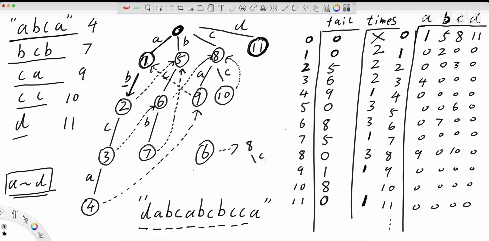
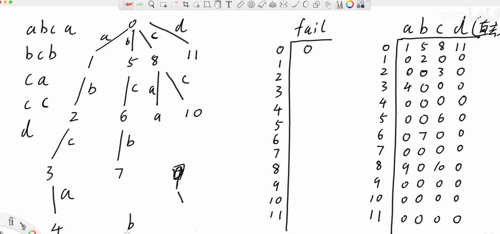

本质上就是把模式串变成一颗 trie, 然后对于每一个节点, 我们都维护一个 fail 指针
fail 指针的含义和 kmp 的含义相同
构建的规则为: 每个节点的 fail 指针, 由他的父节点进行指定
fa[v] = u, 我们会查看, u 的 fail 指针指向的节点, 
这个节点在字典树的下一层中, 有和 v 一样的字符吗 ?
如果有, 那么 v 的 fail 指针, 指向符合条件的那个节点
具体可以参考这个图片

如果没有对应的匹配的节点, 重复上跳, 一直到找到为止
trie 中, 深度为 1 的节点集合, 他们的 fail 指针全部指向 0 节点

匹配过程中, 到了哪个节点(算一次匹配成功), 把从这个节点出发的 fail 指针链上的 全部节点, 词频 + 1 
如果匹配失败, 也是顺着 fail 指针一直上跳到匹配成功为止
  
failu = 节点 u 代表的字符串的最长真后缀，且该后缀必须是某个模式串的前缀 (即能在 Trie 上走到的串)

很显然, 这种不断跳跃 fail 的方式需要优化
那么我们可以想想第一个 while 出现的地方, pattern 组成的前缀树
那个时候会有 fail 指针不断跳跃
我们设当当前的节点是 u, 他的子节点是 v, 我们有一个 trie[u][c] = v
一般来说有
```cpp
int i = u;
while (i && !trie[i][c]) i = fail[i];   // 沿 fail 链找有 c 边的节点
if (trie[i][c]) i = trie[i][c];         // 找到了，走过去
```

核心就在于, trie[fail[u]][c] 在第一步是空的, 那么我们直接把他赋予一个意义不就好了吗
如图

举个例子, 这张图片是一个 ac-auto 的一个经典实现, 我们可以看到 trie 里面有很多 0 
对于 非 0 的点, 意义显然不用说明, 那么对于 0 的点, 我们能否把他的一样转化成
如果 fail 指针访问到这里, 那么他最终应该跳到哪里去呢
由于 fail 指针只会不断上跳, 那么实际上这个功能是可以实现的
一句话说: 直接把 0, 改成 fail 指针访问到这里应该直接去的节点编号(包括 0)

问题： trie 数组里大量是 0（空边），查询时走到空边就得 while 跳 fail，浪费时间。
解法： 把空边（0）替换成"沿着 fail 链往上找，第一个能走 c 的那个节点编号"。
怎么做： BFS 一层层处理，对节点 u 的字符 c：
if (trie[u][c] 存在)  → fail[trie[u][c]] = trie[fail[u]][c]   // 不变
else (trie[u][c] == 0) → trie[u][c] = trie[fail[u]][c]        // ★ 补空边

# AC自动机原理、优化、代码详解  

使用经典AC自动机，会出现fail指针绕圈的现象，具体有如下三个场景  


### 1. 建立AC自动机时设置fail指针；遍历文章时，匹配失败去寻找支路。都需要fail指针绕圈  
优化方式： 课上会重点图解，这是固定的优化，以后建立AC自动机都可以这么做  


### 2. 遍历文章时，不知道是否命中了某个目标字符串，需要fail指针绕圈，进行词频传递  
优化方式：只让当前节点收集词频，在遍历文章结束之后，再统一进行如下处理，防止绕圈  
&emsp;&emsp;&emsp;&emsp;根据fail指针建立反图，然后利用图的遍历来汇总每个节点的词频，题目1的定制优化  


### 3. 遍历文章时，不知道是否命中了某个目标字符串，需要fail指针绕圈，进行及时报警  
优化方式：在设置fail指针时，把命中标记前移防止绕圈，题目2的定制优化  


经过这样的优化，在遍历文章时，就不需要fail指针的跳转了，甚至可以忽略fail指针的存在  
操作fail指针只需要发生在建立AC自动机时，或者文章遍历结束后的离线处理 

## AC 自动机三个优化总结

### 优化一：Trie 图（补空边）

| 项目 | 内容 |
|------|------|
| **干掉的 while** | `while (u && !trie[u][c]) u = fail[u];`（失配寻路绕圈） |
| **问题** | trie 表里大量是 0，每次失配都要沿 fail 链一层层往回找有 c 边的节点 |
| **方案** | build 时把空边填上：`trie[u][c] = trie[fail[u]][c]`，形成传递闭包后每个节点 26 条边全满 |
| **为什么不会乱** | BFS 逐层处理，fail[u] 深度更浅已在前面处理完，下游接上游的答案 |
| **效果** | 查询时 `u = trie[u][c]` 一步到位，不再 while |
| **你的类比** | 和并查集路径压缩同一种思想——把链式回溯的结果预存到数组里 |

---

### 优化二：拓扑累加（fail 树 DP）

| 项目 | 内容 |
|------|------|
| **干掉的 while** | `for (p = u; p; p = fail[p]) res += cnt[p];`（每次匹配沿 fail 链往上累加） |
| **问题** | 每匹配一个字符就要沿 fail 链走一遍祖先链，深度大时退化 |
| **方案** | 匹配时只打标记 `pass[u]++`，全匹配完后 BFS 序倒序一次性传递：`pass[fail[u]] += pass[u]` |
| **为什么 BFS 倒序就是拓扑序** | fail 总指向深度更小的节点，BFS 入队顺序就是深度递增，反过来就是从叶子到根 |
| **你注意到的关键细节** | 这个传递必须走原始 `fail[]`，不能走 trie 表填好的边——方向是反的，走 trie 表会算错 |
| **效果** | 从 N × depth 降到 N + tot |

---

### 优化三：last 指针（输出链接）

| 项目 | 内容 |
|------|------|
| **干掉的 while** | `for (p = u; p; p = fail[p]) if (cnt[p]) ...`（报警时跳过 cnt=0 的无效节点） |
| **场景区分** | 这不是"失配继续匹配"，而是"到达节点后回头看哪些模式串命中了"——fail 干两件事，这是第二件 |
| **问题** | fail 链上大多数节点 cnt=0（不是模式串结尾），报警时白跳浪费步数 |
| **方案** | 每个节点记 `last[v]` = fail 链向上第一个 cnt≠0 的祖先：`last[v] = cnt[fail[v]] ? fail[v] : last[fail[v]]` |
| **效果** | 报警从 ≤ fail深度 步降到 ≤ 模式串数量 步 |

---

### 你的提问路径

看到三个 while → 问能不能不跳链
  ├─ "trie 空边能不能填上"           → 优化一
  ├─ "能不能只打一次标记批量传"       → 优化二
  ├─ "每个点不用传很多次"             → 优化二（本质同一问的递进）
  └─ "你是不是说 last 链只给结尾增加数值" → 澄清：last 是捷径不是加法