# 线性代数的本质

数学的本质就是抽象：把要解决的问题抽象成式子，再按数学规则推导。这样可以完全脱离具体情景，只用规则解题，避免情景里的直觉干扰思考。

## 线性空间（Linear Space）

有原点，有向量集合，向量之间有加法和数乘；每个向量都有相反向量；由此产生的所有向量都在空间内部。

原点须满足：$\vec{v} + \text{原点} = \vec{v}$。

反例：正实数轴（加法封闭，但缺少相反向量）。

符合上述规则的空间就是线性空间。

## 线性变换（Linear Transformation）

向量之间的加法与数乘，在变换前后保持结构：输入向量 $\vec{x}$，经 $f(\vec{x})$ 得到输出向量。

几何上须满足两条规则：原点不动；原本是直线的地方，变换后仍是直线（坐标轴、对角线等均如此）。奇点是规则失效的点（类似算法中的特判）。

本质上，线性变换就是满足：

$$T(\vec{0}) = \vec{0}$$

$$T(\vec{x} + \vec{y}) = T(\vec{x}) + T(\vec{y})$$

$$T(k\vec{x}) = k\,T(\vec{x})$$

## 向量与矩阵（Vector and Matrix）

用「行 × 列」描述矩阵。向量就是一个 $n \times 1$ 的矩阵；矩阵则是一群向量的集合。

输入维度（定义域维度，domain dimension）对应列；输出维度（值域维度，range dimension）对应行。

矩阵乘法本质上就是 $A \times B = C$：把 $B$ 中的每个向量，用 $A$ 的基重新表示，得到 $C$。

矩阵乘法不满足交换律（non-commutative）。

## 线性相关（Linear Dependence）

在二维平面上，两个共线的向量就是线性相关的。所谓线性相关，就是两个向量之间有重叠部分；二维情形下即为共线，否则互为线性无关。两个互相垂直的向量称为正交的。

等价地说：新向量可以用已有向量的线性组合来表示。

## 基（Basis）

生成整个空间的最小向量集合，其中向量必须线性无关。

## 秩（Rank）

秩同时是矩阵和向量空间的概念，表示其中的决定性因素。

对矩阵而言，秩就是最大线性无关组的大小，即矩阵真正有效的维度数。

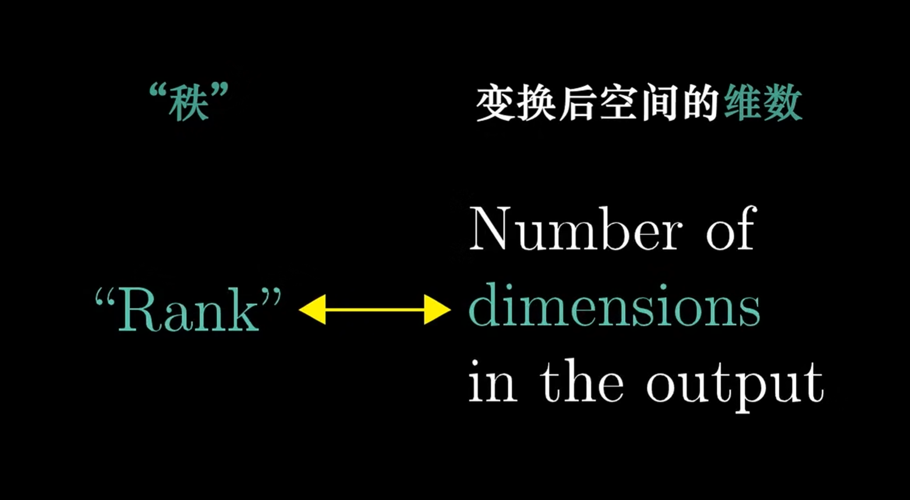

## 行列式（Determinant）

行列式用来描述一个变换矩阵对原线性空间的影响。设 $A \times B = C$，则 $\det(A) = |A|$；$|\det(A)|$ 表示变换后基底对空间/平面的缩放大小；正负号表示手性的反转——例如右手笛卡尔坐标系翻转为左手系。笛卡尔系相当于由一组最大线性无关正交基构造的坐标系。

### 为何行列式来自方程组系数

多元一次方程的系数矩阵，相当于对每个未知量对应的基向量逐一换基。把 $a_1, a_2, \ldots$ 的基分别换成系数列：

$$\begin{bmatrix} k_{11} \\ k_{12} \\ k_{13} \\ \vdots \end{bmatrix}, \quad \begin{bmatrix} k_{21} \\ k_{22} \\ \vdots \end{bmatrix}, \quad \ldots$$

抽出来得到的就是转换矩阵，且该矩阵保持原来的向量维度不变。

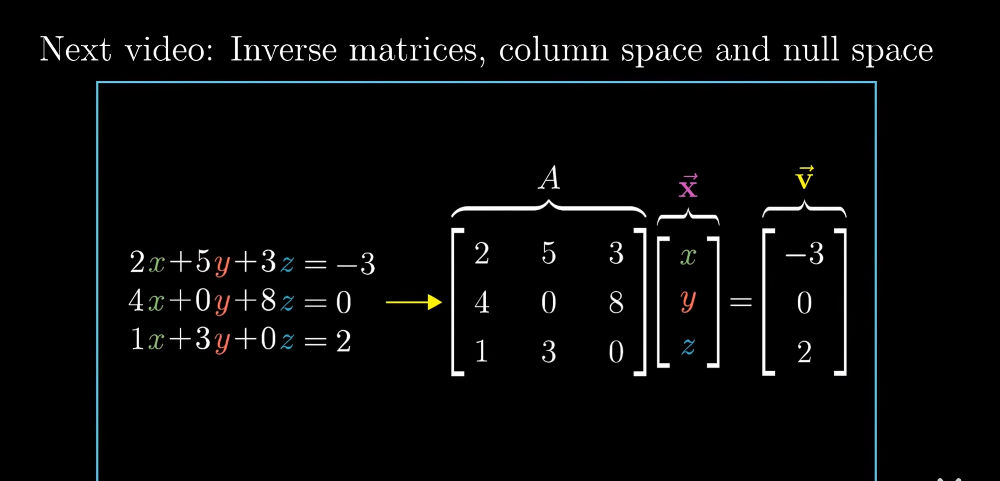

$A$ 是转换矩阵，$\mathbf{x}$ 是被转换的向量，$\mathbf{v}$ 是转换后的结果。

### 从方程组到矩阵乘法

$m$ 个方程、$n$ 个未知数的线性方程组：

$$\begin{cases}
a_{11}x_1 + a_{12}x_2 + \cdots + a_{1n}x_n = b_1 \\
a_{21}x_1 + a_{22}x_2 + \cdots + a_{2n}x_n = b_2 \\
\quad\vdots \\
a_{m1}x_1 + a_{m2}x_2 + \cdots + a_{mn}x_n = b_m
\end{cases}$$

系数矩阵：

$$A = \begin{bmatrix}
a_{11} & a_{12} & \cdots & a_{1n} \\
a_{21} & a_{22} & \cdots & a_{2n} \\
\vdots & \vdots & \ddots & \vdots \\
a_{m1} & a_{m2} & \cdots & a_{mn}
\end{bmatrix}_{m \times n}$$

变元向量：

$$\mathbf{x} = \begin{bmatrix} x_1 \\ x_2 \\ \vdots \\ x_n \end{bmatrix}_{n \times 1}$$

结果向量：

$$\mathbf{b} = \begin{bmatrix} b_1 \\ b_2 \\ \vdots \\ b_m \end{bmatrix}_{m \times 1}$$

矩阵方程：$A\mathbf{x} = \mathbf{b}$。可转化为这种形式的方程组称为线性方程组。

**例 1**（2 方程，2 未知数）：

$$\begin{cases} 2x + 3y = 5 \\ x - y = 2 \end{cases}
\quad \Rightarrow \quad
A = \begin{bmatrix} 2 & 3 \\ 1 & -1 \end{bmatrix},\;
\mathbf{x} = \begin{bmatrix} x \\ y \end{bmatrix},\;
\mathbf{b} = \begin{bmatrix} 5 \\ 2 \end{bmatrix}$$

验证：$A\mathbf{x} = \begin{bmatrix} 2x + 3y \\ x - y \end{bmatrix} = \begin{bmatrix} 5 \\ 2 \end{bmatrix}$，与原方程组一致。

**例 2**（3 方程，2 未知数，超定方程组）：

$$\begin{bmatrix} 1 & 2 \\ 3 & 4 \\ 5 & 6 \end{bmatrix}
\begin{bmatrix} x \\ y \end{bmatrix}
= \begin{bmatrix} 1 \\ 2 \\ 3 \end{bmatrix}$$

此处 $A$ 是 $3 \times 2$ 矩阵，不是方阵，没有行列式。

### 换基视角

$A\mathbf{x} = \mathbf{b}$ 的几何解释：

- 矩阵 $A$ 的每一列是一个向量（新基向量）
- $\mathbf{x}$ 是这些基向量的线性组合系数（在新基下的坐标）
- $\mathbf{b}$ 是在标准基下这个线性组合的结果

矩阵 $A$ 定义了「新基」，$\mathbf{x}$ 是「在新基下的坐标」，$\mathbf{b}$ 是「在标准基下的位置」。解方程就是：已知 $A$（新基）和 $\mathbf{b}$（目标位置），求 $\mathbf{x}$（在新基下的坐标）。

映射 $f: \mathbb{R}^n \to \mathbb{R}^m$，$f(\mathbf{x}) = A\mathbf{x}$，满足：

$$f(\mathbf{u} + \mathbf{v}) = A\mathbf{u} + A\mathbf{v}, \quad f(k\mathbf{u}) = kA\mathbf{u}$$

这正是线性变换的代数实现。

| 概念 | 对应 |
|------|------|
| 线性变换 | 矩阵 $A$ 代表的映射 |
| 输入向量 | 变元向量 $\mathbf{x}$ |
| 输出向量 | 结果向量 $\mathbf{b}$ |
| 解方程 | 寻找 $\mathbf{x}$ 使得变换后得到 $\mathbf{b}$ |
| 奇点（$\det = 0$） | $A$ 为方阵且 $\det(A) = 0$ 时，变换不可逆 |

$$A_{m \times n}\,\mathbf{x}_{n \times 1} = \mathbf{b}_{m \times 1}$$

### 行列式为零

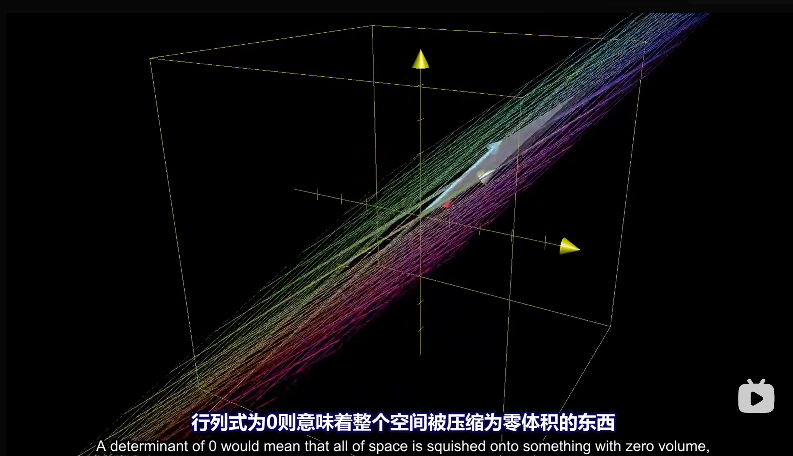

$\det(A) = 0$ 时，转换矩阵中换的基底至少有两个线性相关，维度缩小一维，导致有一维的向量无解。本质上就是变换矩阵化简后是非满秩的。

## 逆矩阵（Inverse Matrix）

逆矩阵记作 $A^{-1}$，满足 $A^{-1} A = I$（单位矩阵，秩为 2）。

普通矩阵是正向变换，逆矩阵是逆过程。逆矩阵存在的条件是 $\det(A) \ne 0$。

当 $\det(A) = 0$ 时会出现维度被压缩的情况——没有任何函数能把「面」解压缩成「体」。在被压缩后的线上指定一个解，还原回去会发现一个输入向量对应整条线：

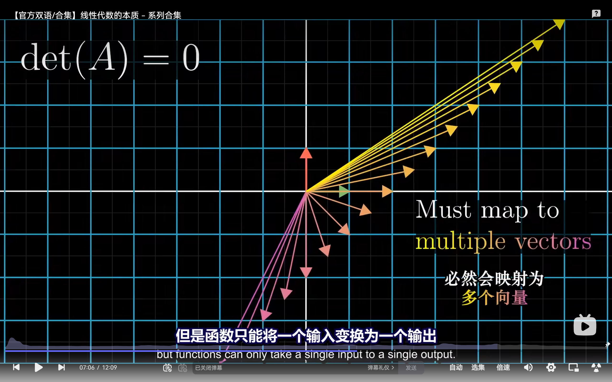

函数只能是一个输入对应一个输出。

## 列空间（Column Space）

把矩阵看作一群向量的集合，其中所有向量经加法与数乘能张成的空间就是列空间。

秩等于列空间的维度。

## 零空间（Null Space）与核（Kernel）

当空间被压缩时，会有一整个子空间的向量被压到原点：

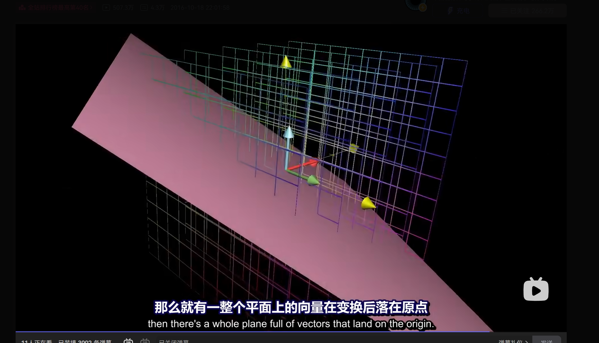
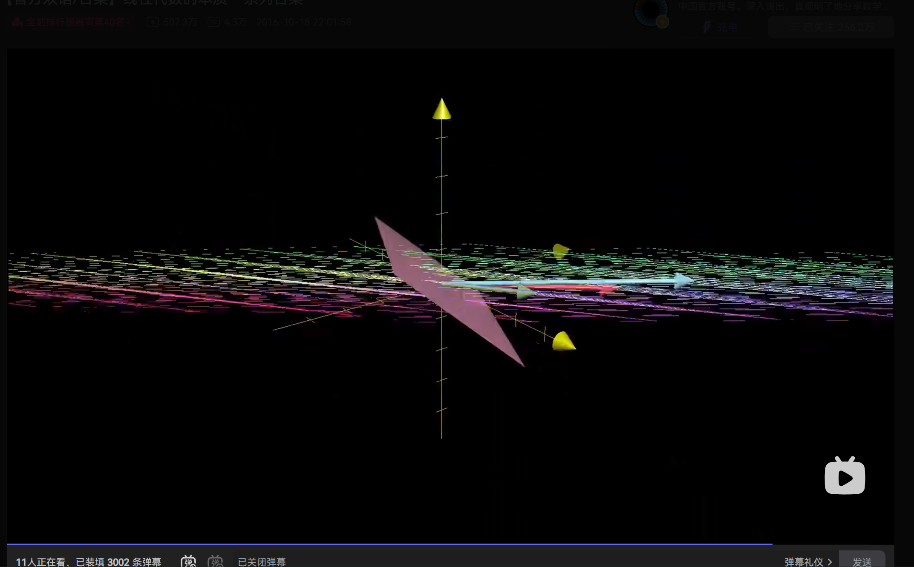
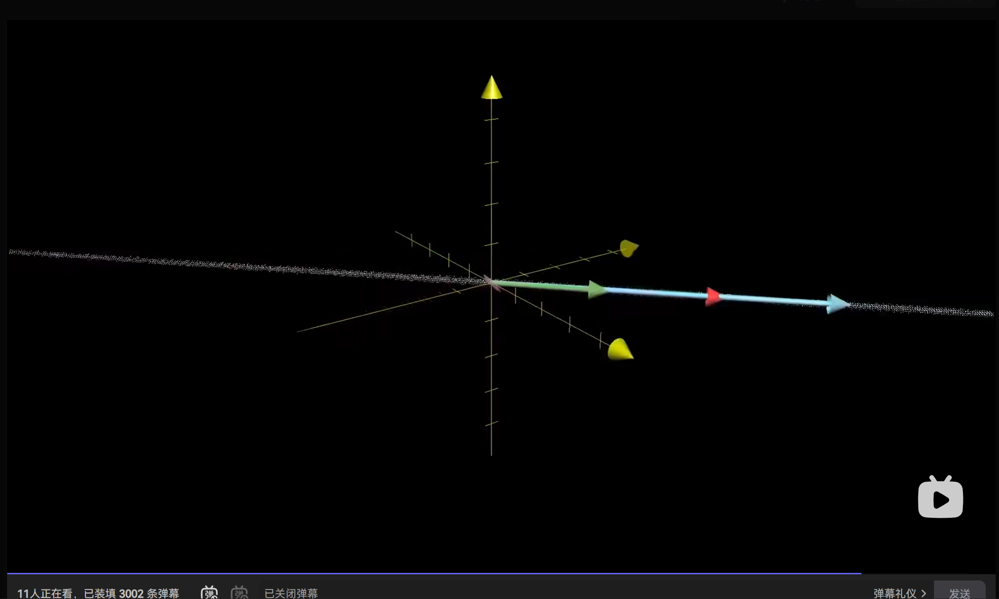

对 $A\vec{x} = \vec{v}$，当 $\vec{v} = \vec{0}$ 时，零空间就是该方程所有解 $\vec{x}$ 的集合——即结果向量为原点时方程的解集。

## 点积（Dot Product）

点积把向量各维度的积加起来：

$$\vec{a} \cdot \vec{b} = \text{res}$$

结果相当于 $\vec{a}$ 在 $\vec{b}$ 上的投影长度乘以 $|\vec{b}|$。夹角小于 $90°$ 时点积为正，等于 $90°$ 时为 $0$，大于 $90°$ 时为负。

本质上，点积相当于把向量 $\vec{a}$ 压缩为数轴上的一个数，位置由 $\vec{b}$ 决定。也相当于把 $\vec{b}$ 转置后做矩阵乘法：$[1 \times n]$ 矩阵乘以 $[n \times 1]$ 矩阵，得到 $1 \times 1$ 矩阵。点积得到数字，转置乘法也得到数字，逻辑自洽。

## 线性性（Linearity）

线性性描述一种变换是否允许「先操作后变换」与「先变换后操作」结果相同。须满足：

- 可加性（superposition）：$f(x + y) = f(x) + f(y)$
- 齐次性（homogeneity）：$f(ax) = a\,f(x)$

推论：$f(0) = 0$。几何上即原点不变，直线变换后仍是直线。

### 点积与投影

在二维平面上，把平面压缩到一条过原点的直线，本质上是一次线性变换，可用矩阵乘法表示，也可抽象为一个函数（经线性性检验后确认）。

压缩后，所有向量的终点都落在这条数轴（同时也是平面中的一个向量）上的投影。

观察原基向量 $(1, 0)$ 和 $(0, 1)$ 变换后变成什么，拼接成矩阵即为变换矩阵：

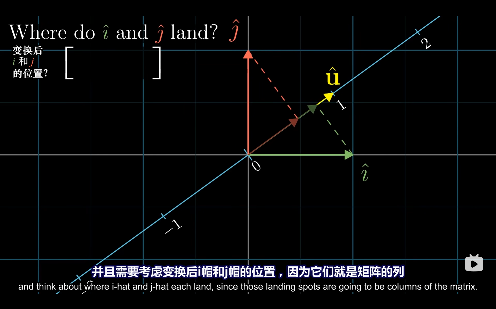

可以证明，该变换矩阵就是压缩后数轴上的单位向量（在原来二维平面中的表示）：

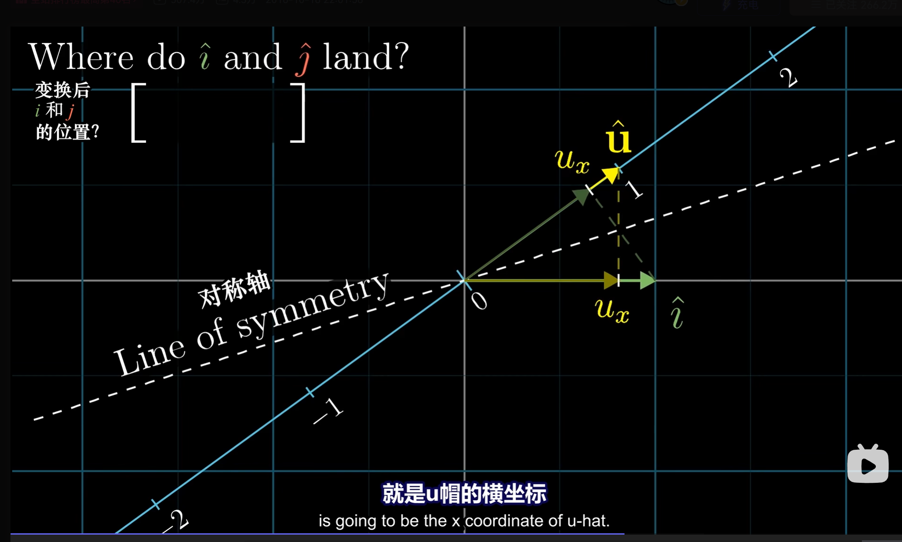

这里运用了对偶性（duality）。

两个向量的点积，相当于转置后做矩阵乘法，得到一个数轴上的数。设数轴单位向量为 $\vec{u}$，变换矩阵为：

$$\begin{bmatrix} u_x & u_y \end{bmatrix}$$

对非单位向量，由线性性可写成单位向量的 $k$ 倍，故：

$$\vec{a} \cdot \vec{b} = |\vec{a}| \times \operatorname{proj}_{\vec{a}} \vec{b}$$

点积是表示线性变换的矩阵乘法的特殊形式。任何时候看到一个输出空间是一维数轴的线性变换，空间中都会存在唯一的向量 $\vec{v}$ 与之对应。

## 叉积（Cross Product）

叉积得到以两个向量为边的平行四边形面积。但叉积只存在于三维和七维向量；结果不是标量，而是垂直于当前平面的法向量，模长为平行四边形面积，方向由右手定则判定。

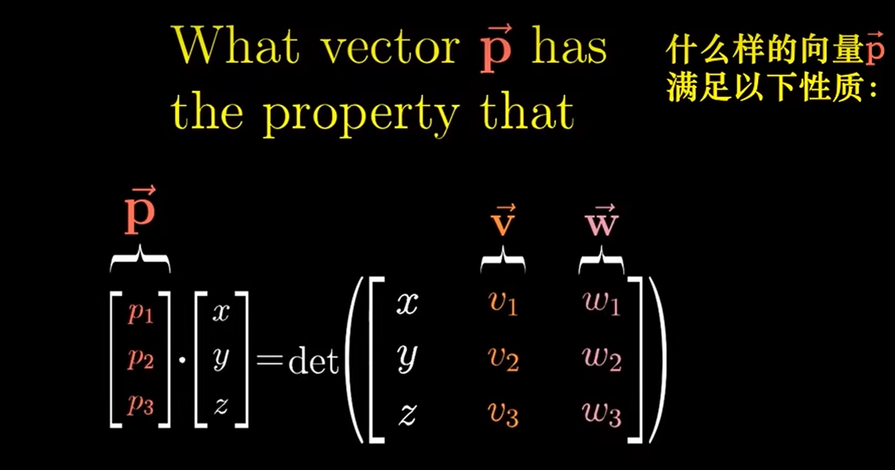

## 换基（Change of Basis）

向量 $\vec{v}$ 在标准基 $I$ 下描述。换到坐标系 $I_1$，对 $\vec{v}$ 施加一个线性变换，得到的是 $\vec{v}$ 在 $I$ 语义下、位于 $I_1$ 坐标系的坐标。

如何用 $I_1$ 的坐标基描述一个线性变换？

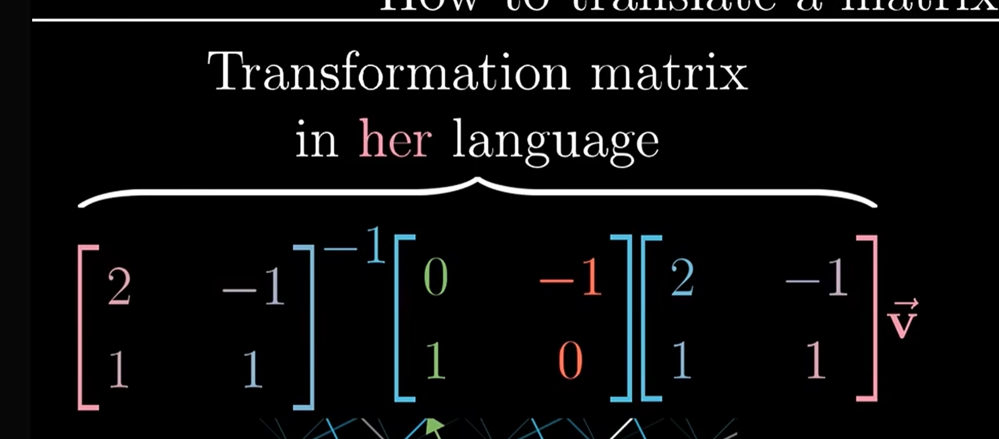

$$I_1^{-1} \times A \times I_1$$

一个向量在两个基底中的坐标不同。换基本质上是一种线性变换——$\vec{v}$ 在 $I_2$ 基底中、用 $I_1$ 的表示，就是这样。

## 特征向量与特征值（Eigenvector and Eigenvalue）

对某个线性变换，有些向量只发生缩放、不发生旋转，这样的向量称为特征向量，缩放倍数为特征值。特征值可以为负（缩放涉及反向）。

特征向量可视为线性变换中的「旋转轴」。

若算出的特征向量足以张成整个空间，不妨用它们换基。此时变换矩阵是对角矩阵，运算极为方便。

一个线性变换，等于先换到特征向量组构成的基底，再按特征值缩放。对角矩阵描述的是换基语义下的线性变换。为方便运算：先换基，算对角矩阵，再用换基的逆矩阵还原。

## 向量空间究竟是什么

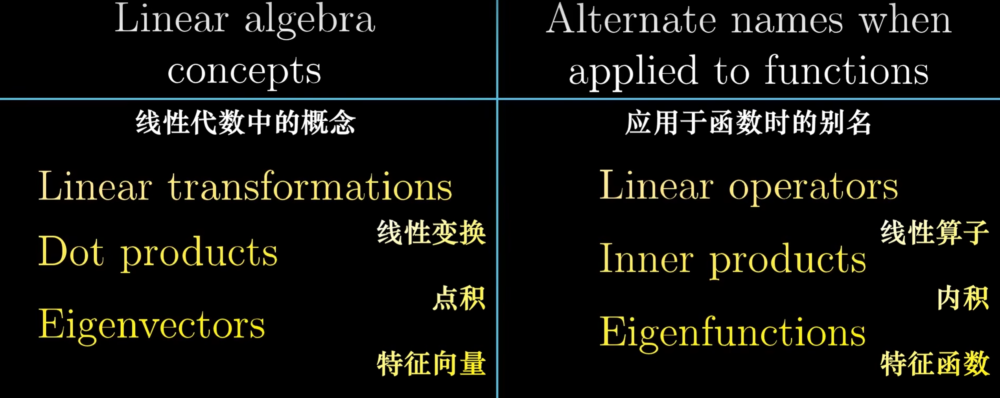
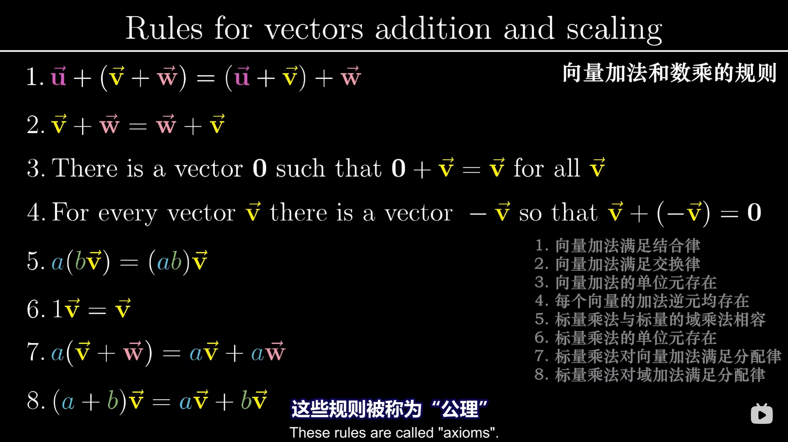

矩阵乘法之所以是乘法，本质上就是换基：按预先知道的规则，对这些基底进行数乘、相加，得到新矩阵。

点积是函数运算形式的简化——本质是矩阵乘法，但可以写作两个向量直接相乘。

Abstractness is the price of generality.

### 从基础解系出发的概念链

**解空间（零空间）**：所有满足 $A\vec{x} = \vec{0}$ 的向量 $\vec{x}$ 的集合。几何上，是被线性变换 $A$ 完全压扁到原点的那部分空间。

**秩**：线性变换后幸存下来的空间维度（列空间的维度），即矩阵 $A$ 真正有效的行/列数。

**维数定理**：$\text{初始维度} = \text{秩} + \text{解空间维度}$。原空间的每一维，变换后要么幸存（计入秩），要么被压扁消失（计入解空间）。

**基础解系**：解空间的一组基底，由极大线性无关的解向量组成，能张成整个被压扁的空间。向量个数 = 解空间维度 = 初始维度 − 秩。

**自由变元**：矩阵化为行最简形后，没有主元的列对应的变量。它们代表的维度是冗余的——这些列可被主列线性表出，因此有一个能自由游走的方向，对应解空间的一个维度。数量 = 解空间维度。

**代入规则**：自由变元轮流置 $1$、其余置 $0$，回代解出主变量。在零空间里，沿着每个自由维度方向各走一个单位步长，取到的向量自然线性无关，构成一组基。

矩阵 $A$ 是一台压扁空间的机器：秩告诉你压完后还剩几维；解空间告诉你哪些部分被压进原点消失了；基础解系，是为那片消失的废墟画出的骨架地图。